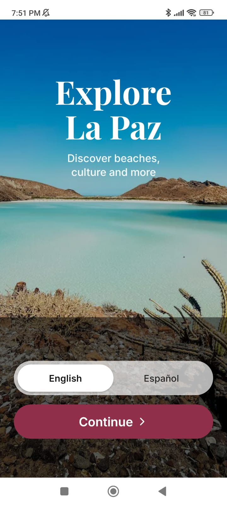
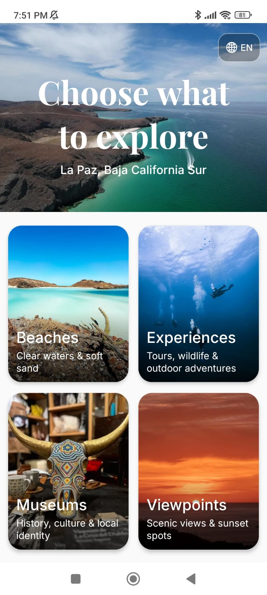
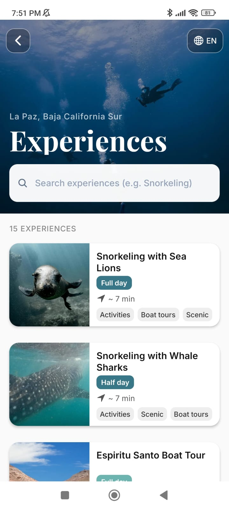
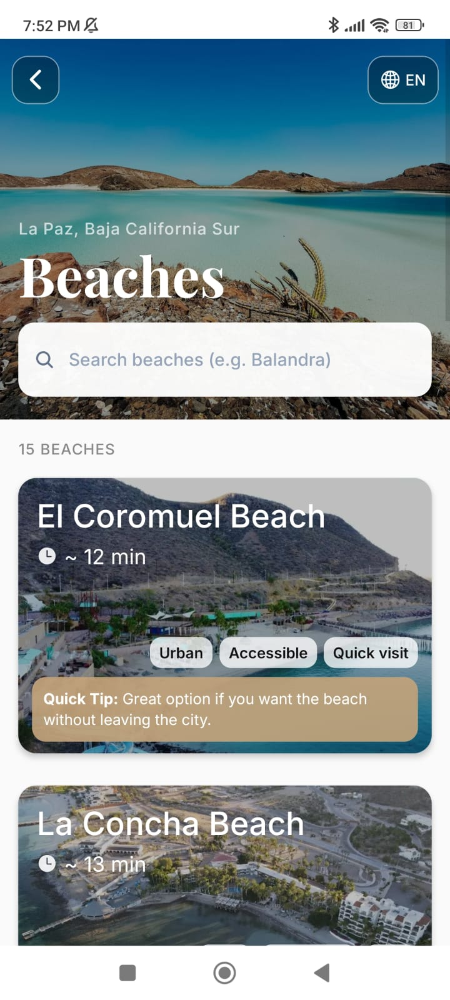
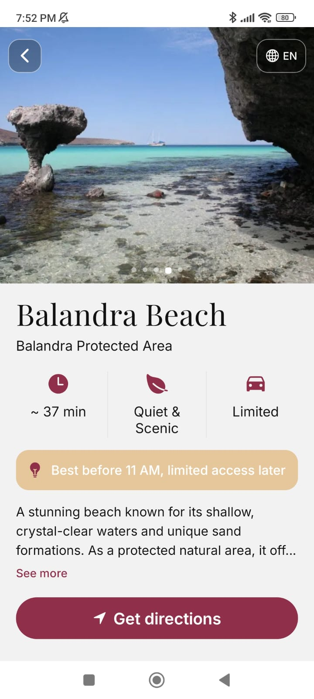
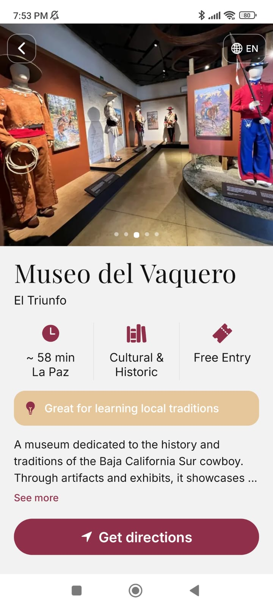

# 🌊 Turismo La Paz

Mobile application designed to help residents and visitors discover tourist attractions and experiences in La Paz, Baja California Sur, Mexico.

The app centralizes more than 40 tourist attractions through geolocation, distance-based recommendations, category filtering, and bilingual support.

This project was presented before the La Paz City Hall and the Municipal Tourism Department as part of an academic collaboration initiative.

---

## Features

- Explore more than 40 tourist attractions
- Distance-based recommendations using geolocation
- Category filtering for faster discovery
- Attraction details with recommendations and tips
- Google Maps integration for navigation
- English and Spanish support

---

## Tech Stack

- React Native
- Expo
- TypeScript
- Expo Location
- React Navigation

---

## APK

Download the latest Android version from the Releases section.

👉 https://github.com/cburgoin-dev/turismo-la-paz/releases/latest

---

## Screenshots

The screenshots below showcase the main experiences available in the application.

| Home | Explore | Experiences |
|---|---|---|
|  |  |  |

| Beaches | Beach Details | Museum Details |
|---|---|---|
|  |  |  |

---

## Academic Context

This project was developed as part of an academic collaboration initiative focused on promoting local tourism through digital solutions.

The application was presented before representatives from:

- La Paz City Hall
- Municipal Tourism Department

with the objective of exploring technological tools that improve access to local tourism information.
